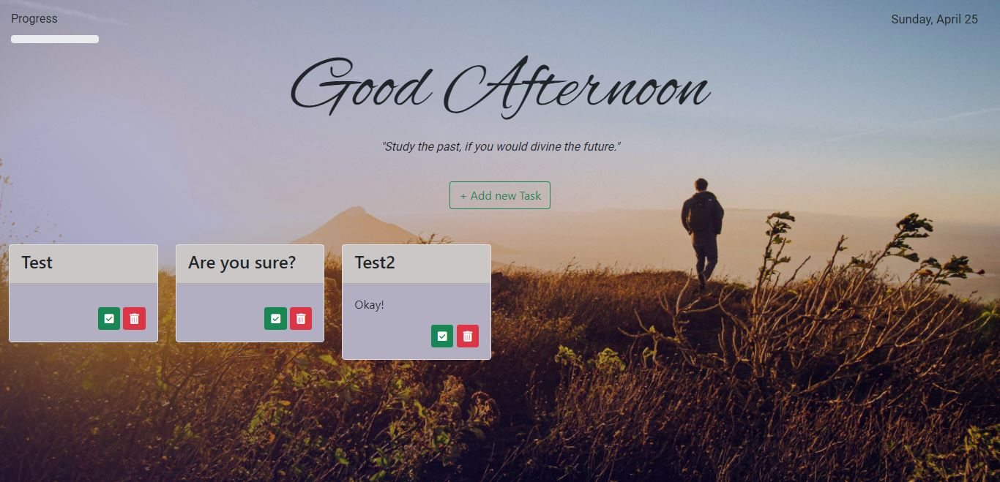
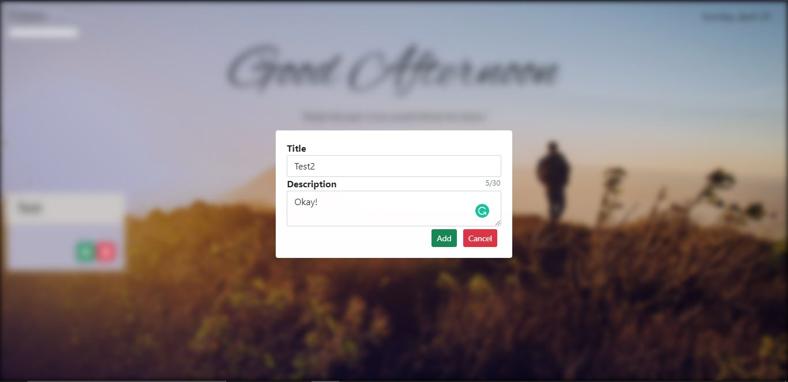
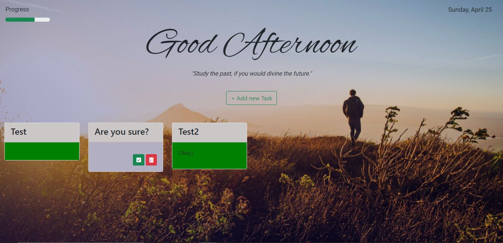

# To_Do_List
A desktop web application for the user to keep a track of the tasks to be done in the day. The content in the application is dynamic and changes timely. Data is fetched from motivational quote api and a random quote is then displayed on the view port.

# Tech Stack Used
<strong>Frontend:</strong> CSS, JS, Bootstrap, JQuery, EJS
 
<strong>Backend:</strong> Node.js, Express.js, MongoDB, Mongoose

<strong>Here are some insights of the application :</strong>

# The Main Landing

# Adding New Tasks

# Application in action

